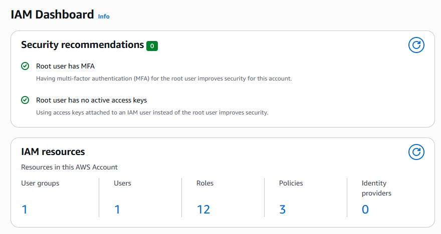
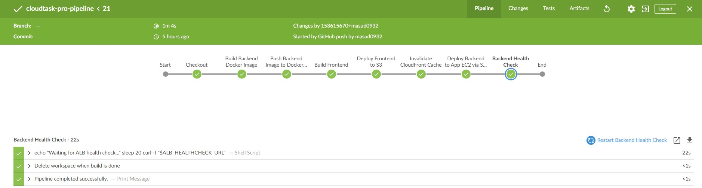
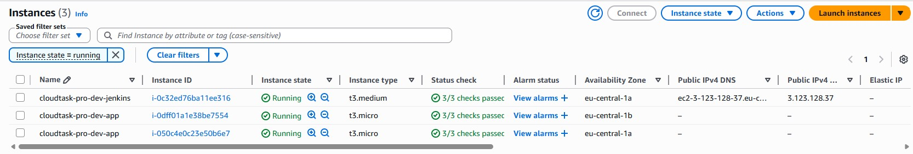
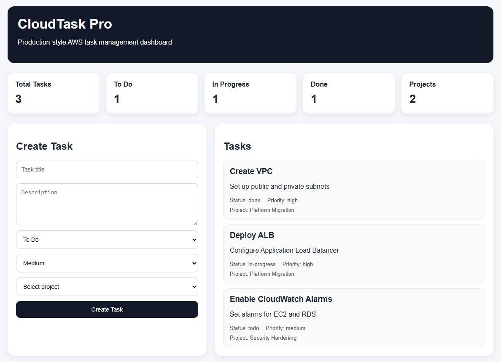

# CloudTask Pro — Production-Grade Task Management Platform on AWS
CloudTask Pro is a full-stack task management platform built and deployed on AWS using a production-style cloud architecture. It enables users to create and manage tasks, organize work by projects, and view dashboard metrics through a modern web interface.
This project was developed to demonstrate practical cloud engineering, DevOps, and infrastructure automation skills using AWS, Terraform, Docker, Jenkins, and CI/CD pipeline best practices.

## What This Project Includes
-	Local development setup
-	Optional Docker containerization
-	AWS infrastructure provisioning with Terraform
-	Jenkins server setup
-	CI/CD pipeline implementation
-	Application deployment and verification
-	Monitoring and troubleshooting
-	Security best practices
-	Technical challenges and resolutions
-	Future improvements
-	Screenshots and project outputs
-	Cleanup and infrastructure removal

## Architecture Overview
CloudTask Pro follows a production-style three-tier AWS architecture.
### Presentation Layer
-	React and Vite frontend
-	Amazon S3 for static hosting
-	Amazon CloudFront for content delivery
-	HTTPS access for users
### Application Layer
-	Backend application deployed as a Docker container 
-	Backend runs on Amazon EC2 instances inside an Auto Scaling Group 
-	Application Load Balancer distributes incoming traffic 
-	Jenkins triggers backend deployments through AWS Systems Manager (SSM) 
### Data Layer
-	PostgreSQL database hosted on Amazon RDS 
-	Database deployed inside private subnets 
-	Database credentials stored securely in AWS Secrets Manager 

## Tech Stack
### Frontend
-	React
-	Vite
-	JavaScript
-	CSS
### Backend
-	Node.js
-	Express.js
-	PostgreSQL
-	Docker
### Infrastructure
-	Terraform
-	IAM Roles and Policies
-	Amazon VPC
-	Public and Private Subnets
-	Internet Gateway
-	NAT Gateway
-	Route Tables
-	Security Groups
-	Application Load Balancer
-	Auto Scaling Group
-	Amazon EC2
-	Amazon RDS PostgreSQL
-	Amazon S3
-	Amazon CloudFront
-	AWS Secrets Manager
-	AWS Systems Manager (SSM)
-	Amazon CloudWatch
-	Amazon SNS
 
### CI/CD
-	Jenkins
-	Docker Hub
-	GitHub Webhooks

## Phase 1: Initial Setup and Local Development
### Step 1: Clone the Repository
-   Clone the project repository.
-   Move into the project directory.
```bash
git clone https://github.com/masud0932/cloudtask-pro-aws.git
cd cloudtask-pro-aws
```
### Step 2: Install Required Tools
Install the following tools before running the project:
-   Git
-   Docker
-   Node.js
-   npm
-   Terraform
-   AWS CLI

### Step 3: Start Local PostgreSQL with Docker
```bash
docker run --name cloudtask-postgres \
  -e POSTGRES_DB=cloudtask \
  -e POSTGRES_USER=postgres \
  -e POSTGRES_PASSWORD=postgres \
  -p 5432:5432 \
  -d postgres:16
  ```
### Step 4: Run Backend Locally
```bash
```bashcd app/backend
npm install
npm run dev
```
- Backend runs on: http://localhost:3000

### Step 5: Run Frontend Locally
```bash
cd app/frontend
npm install
npm run dev
```
- Frontend runs on: http://localhost:5173

### Note:
- PostgreSQL container must be running before backend starts
- Frontend .env must have: VITE_API_BASE_URL=http://localhost:3000


## Phase 2: Optional Containerization with Docker
### Step 1: Build Backend Docker Image
```bash
cd app/backend
docker build -t cloudtask-backend .
```
### Step 2: Run Backend Container
```bash
docker run -d \
  --name cloudtask-backend \
  -p 3000:3000 \
  --env-file .env \
  cloudtask-backend
```
-   Backend runs on: http://localhost:3000

### Step 3: Build Frontend Docker Image
```bash
cd app/frontend
docker build -t cloudtask-frontend .
```
### Step 4: Run Frontend Container
```bash
docker run -d \
  --name cloudtask-frontend \
  -p 80:80 \
  cloudtask-frontend
```
-   Frontend runs on: http://localhost:80

## Phase 3: AWS Infrastructure Provisioning with Terraform
### Step 1: Configure AWS Access for Terraform
-   Create a dedicated IAM user for Terraform deployment.
-   Attach required AWS permissions for services:
-   EC2
-   VPC
-   IAM
-   RDS
-   S3
-   CloudFront
-   Secrets Manager
-   Auto Scaling
-   CloudWatch
-   Generate Access Key ID and Secret Access Key.
### Step 2: Configure AWS CLI
```bash
aws configure
```
Provide:
-   AWS Access Key ID
-   AWS Secret Access Key
-   Default region: eu-central-1
-   Output format: json
### Step 3: Initialize Terraform
```bash
cd terraform/environments/dev
terraform init
```
### Step 4: Validate and Format Terraform Files
```bash
terraform fmt -recursive
terraform validate
```
### Step 5: Review Infrastructure Changes
```bash
terraform plan
```
### Step 6: Deploy Infrastructure
```bash
terraform apply -auto-approve
```
### Step 7: Verify Created Resources
-   VPC
-   Public and Private Subnets
-   Internet Gateway
-   NAT Gateway
-   Route Tables
-   Security Groups
-   AWS Systems Manager (SSM)
-   EC2 Instances
-   Application Load Balancer
-   Auto Scaling Group
-   RDS PostgreSQL
-   S3 Bucket
-   CloudFront Distribution
-   Secrets Manager
-   CloudWatch Logs and Alarms


## Phase 4: Jenkins Server Setup
### Step 1: Launch Jenkins EC2 Instance
-   Provision an Amazon Linux EC2 instance for Jenkins.
-   Attach the required IAM role, security group, and EC2 key pair for SSH access.
-   Ensure port 8080 is open in the Jenkins server security group for web access.

### Step 2: Bootstrap Jenkins Server
-   Install Git, Docker, and SSM Agent.
-   Enable Docker and SSM services.
-   Add ec2-user to the Docker group.
```bash
yum update -y
yum install -y docker git amazon-ssm-agent
systemctl enable docker
systemctl start docker
systemctl enable amazon-ssm-agent
systemctl start amazon-ssm-agent
usermod -aG docker ec2-user
```
### Step 3: Build Custom Jenkins Docker Image
```bash
FROM jenkins/jenkins:lts
USER root
RUN yum update && \
    yum install -y docker.io git curl && \
    rm -rf /var/lib/yum/lists/*
USER jenkins
```
### Step 4: Run Jenkins Container with Docker Socket Mount
```bash
docker build -t my-jenkins-docker .

docker run -d \
  --name jenkins \
  --restart unless-stopped \
  --user root \
  -p 8080:8080 \
  -p 50000:50000 \
  -v /var/jenkins_home:/var/jenkins_home \
  -v /var/run/docker.sock:/var/run/docker.sock \
  my-jenkins-docker
  ```
### Step 5: Configure Jenkins
-   Browse Jenkins on: http://<jenkins-ec2-public-ip>:8080
-   Install suggested plugins.
-   Install Blue Ocean, GitHub, Git Push plugins.
-   Add GitHub webhook.
-   Configure Docker Hub credentials.
-   Configure SSH or SSM deployment access.
-   Create Jenkins pipeline job.


## Phase 5: CI/CD Pipeline Execution
### Step 1: Trigger Pipeline
-   Push code changes to GitHub.
-   GitHub webhook triggers Jenkins automatically.
### Step 2: Pipeline Stages
1.  Clone Source Code
2.  Build Frontend
3.  DeployFrontend to S3
4.  Invalidate CloudFront Cache
5.  Build Backend Docker Image
6.  Push Docker Image to Docker Hub
7.  Trigger Deployment on App EC2 via SSM
8.  Run Health Check
9.  Verify Deployment Success
### Step 3: Backend Deployment Script
```bash
./scripts/deploy-backend.sh <app_secret_arn> <aws_region> <app_port>
```
### Step 4: Deployment Process
-   Fetch application secret from AWS Secrets Manager.
-   Fetch RDS credentials from AWS Secrets Manager.
-   Pull latest Docker image.
-   Stop and remove old container.
-   Start new container with environment variables.
-   Run /health endpoint check.
-   Log deployment output to /var/log/deploy-backend.log.
### Step 5: Monitor Build Logs
```bash
docker logs jenkins
docker logs cloudtask-pro
sudo tail -f /var/log/deploy-backend.log
sudo tail -f /var/log/user-data.log
```

## Phase 6: Application Deployment and Verification
### Step 1: Bootstrap Application EC2 Instance
-   Install Docker, AWS CLI, jq, and SSM Agent.
-   Enable Docker and SSM services.
-   Create deployment directory.
```bash
yum update -y
yum install -y docker aws-cli jq amazon-ssm-agent
systemctl enable docker
systemctl start docker
systemctl enable amazon-ssm-agent
systemctl start amazon-ssm-agent
```
### Step 2: Initial Application Deployment
-   Fetch app secrets from AWS Secrets Manager.
-   Fetch RDS credentials from managed DB secret.
-   Pull Docker image from Docker Hub.
-   Start backend container.
```bash
docker run -d \
  --name cloudtask-pro \
  -p 3000:3000 \
  --restart unless-stopped \
  -e PORT=3000 \
  -e NODE_ENV=production \
  -e RUN_DB_INIT=true \
  -e DB_HOST=<db_host> \
  -e DB_PORT=<db_port> \
  -e DB_NAME=<db_name> \
  -e DB_USER=<db_user> \
  -e DB_PASSWORD=<db_password> \
  masudrana09/cloudtask-pro:latest
```

### Step 3: Verify Application Health
```bash
APP_PORT=3000
curl http://localhost:${APP_PORT}/health
```

### Step 4: Verify Frontend and Backend Connectivity
-   Confirm frontend can communicate with backend API.
-   Verify ALB target group shows healthy targets.
-   Verify tasks and projects load correctly.
Step 5: Validate Security
-   Frontend served through HTTPS.
-   Backend served internally through HTTP.
-   Database remains in private subnet.
-   Secrets stored in AWS Secrets Manager.
Restricted security group access between ALB, app server, and RDS.

## Phase 7: Monitoring and Troubleshooting
### Step 1: Monitor Infrastructure
-   Use CloudWatch for logs and alarms.
-   Monitor EC2 CPU, memory, and disk usage.
-   Monitor RDS database metrics.
-   Monitor ALB target health.
-   Monitor Auto Scaling activity.
### Step 2: Configure Notifications
-   Configure CloudWatch alarms.
-   Send notifications using SNS.
-   Notify when:
-   EC2 CPU is too high
-   ALB target becomes unhealthy
-   RDS storage is low
-   Deployment fails
-   Auto Scaling launches or terminates instances
### Step 3: Common Troubleshooting Areas
-   Frontend cannot connect to backend.
-   Backend cannot connect to database.
-   Jenkins webhook not triggering.
-   Docker container crashes.
-   Security group misconfiguration.
-   ALB target unhealthy.
-   Incorrect environment variables.
-   CloudFront returns 403 error.
-   SSM deployment command fails.

## Phase 8: Security
### Step 1: IAM and Access Control
-   Use IAM roles instead of static credentials.
-   Apply least-privilege permissions.
-   Restrict EC2, Jenkins, and SSM permissions.
### Step 2: Network Security
-   Use private subnets for backend and database.
-   Restrict security groups between ALB, EC2, and RDS.
-   Allow only required ports.
### Step 3: Secret Management
-   Store database credentials in AWS Secrets Manager.
-   Avoid storing secrets inside code or GitHub.
-   Retrieve secrets dynamically during deployment.
### Step 4: Container Security
-   Use images built by the project pipeline and stored in Docker Hub 
-   Avoid hardcoded credentials inside container images 
-   Use environment variables and Secrets Manager for runtime secrets
### Step 5: Logging and Auditing
-   Use CloudWatch logs.
-   Use SSM command history.
Track Jenkins deployment logs.

## Phase 9: Technical Challenges and Resolutions
### Step 1: Jenkins Container Missing Node.js and npm
**Challenge:** The Jenkins server was running inside Docker, but the base Jenkins image did not include Node.js or npm.

**Solution:** A custom Jenkins Docker image was created with Node.js and npm preinstalled.

### Step 2: Frontend Build Artifacts Missing
**Challenge:** The frontend deployment failed because the dist/ folder did not exist.

**Solution:** The frontend stage was updated to use:
```bash
npm ci
npm run build
```

### Step 3: Missing IAM Permissions for Jenkins
**Challenge:** Jenkins could not use AWS SSM deployment commands.

**Solution:** Additional IAM permissions were added: 

- ssm:SendCommand 
- ssm:ListCommandInvocations 
- ssm:DescribeInstanceInformation

### Step 4: Backend Deployment Script Timeout
**Challenge:** Backend deployments frequently timed out.

**Solution:**
- Added SSM status polling 
- Increased wait times 
- Printed detailed SSM failure output

### Step 5: CloudFront Returning 403 Access Denied
**Challenge:** CloudFront returned 403 AccessDenied.

**Solution:** 
- Set default root object to index.html 
- Fixed S3 bucket permissions 
- Configured static website hosting

### Step 6: Vite Environment Variable Not Loading
**Challenge:** The frontend API base URL was undefined.

**Solution:** Updated:
```bash
import.meta.env.VITE_API_BASE_URL
```

### Step 7: Backend API Returning 500 Errors
**Challenge:** API requests returned 500 Internal Server Error.

**Solution:** Enabled automatic database  initialization using:
```bash
-e RUN_DB_INIT=true
```

### Step 8: Database Initialization Was Being Skipped
**Challenge:** The backend logs showed:
Skipping database initialization

**Solution:** The deployment script was updated to include:
```bash
-e RUN_DB_INIT=true
```

### Step 9: Jenkins Was Using an Outdated Deployment Script
**Challenge:** Jenkins continued using an older deploy-backend.sh file.

**Solution:** The Jenkins pipeline was redesigned to upload the latest deployment script during every deployment.

### Step 10: Wrong Secret Value Passed to Backend Deployment
**Challenge:** The deployment script originally received an EC2 instance ARN instead of the application secret ARN.

**Solution:** The Jenkins pipeline was updated to pass the correct AWS Secrets Manager ARN.
```bash
aws secretsmanager list-secrets \
  --region eu-central-1 \
  --query 'SecretList[*].[Name,ARN]' \
  --output table
  ```

## Phase 10: Future Improvements
### Step 1: Add Route 53 Domain
-   Configure custom domain.
-   Add SSL certificate.

### Step 2: End-to-End HTTPS
-   Add AWS Certificate Manager (ACM).
-   Add HTTPS listener on ALB.

### Step 3: Migrate to Kubernetes
-   Use EKS for orchestration.
-   Deploy with Helm charts.
### Step 4: Improve Monitoring
-   Add Prometheus and Grafana.
-   Add centralized logging.
### Step 5: Infrastructure Security Improvements
-   Move all app instances to private subnets.
-   Add AWS WAF.
-   Add GuardDuty.


## Phase 11: Screenshots
### Terraform Apply Output

### IAM Dashboard

### Jenkins Pipeline Success

### EC2 Instances

### Frontend Dashboard


## Phase 12: Cleanup and Destroy Infrastructure

### Step 1: Stop Running Containers
```bash
docker stop jenkins
docker stop cloudtask-pro
docker rm -f jenkins
docker rm -f cloudtask-pro
```
### Step 2: Remove Docker Images
```bash
docker rmi my-jenkins-docker
docker rmi masudrana09/cloudtask-pro:latest
```
### Step 3: Destroy Terraform Infrastructure
```bash
cd terraform/environments/dev
terraform destroy -auto-approve
```
### Step 4: Verify Cleanup
-   Confirm EC2 instances are terminated.
-   Confirm ALB is deleted.
-   Confirm RDS is deleted.
-   Confirm CloudFront distribution is deleted.
-   Confirm S3 bucket is deleted.