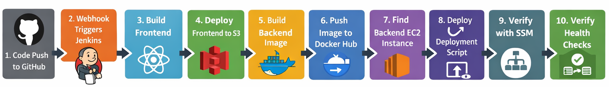
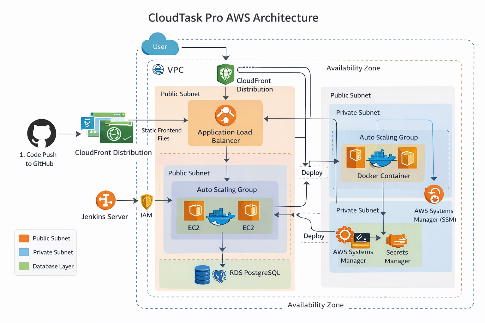

# CloudTask Pro — AWS 3-Tier Platform
CloudTask Pro is a production-style full-stack task management platform deployed on AWS using Terraform, Jenkins, Docker, and modern DevOps practices. The project demonstrates a scalable three-tier cloud architecture with automated infrastructure provisioning, CI/CD deployment automation, secure secret management, monitoring, and operational best practices.

The platform enables users to create and manage tasks, organize projects, and monitor dashboard metrics through a modern web interface. The frontend is hosted on Amazon S3 and CloudFront, while the backend is deployed on Docker-based EC2 application servers behind an Application Load Balancer with Auto Scaling support. PostgreSQL is hosted on Amazon RDS within private subnets for secure data storage.

Infrastructure provisioning is fully automated using Terraform, while Jenkins automates frontend and backend deployment workflows through GitHub webhooks, Docker Hub, and AWS Systems Manager (SSM).

## Key Features

- Production-style AWS 3-tier architecture
- Terraform-based Infrastructure as Code
- Jenkins CI/CD automation
- Dockerized backend deployment
- EC2 Auto Scaling Group with ALB
- Frontend hosting with S3 and CloudFront
- Secure secret management with AWS Secrets Manager
- Monitoring with CloudWatch and SNS
- Deployment automation using AWS Systems Manager

## Architecture Overview

CloudTask Pro follows a production-style three-tier AWS architecture designed for scalability, security, deployment automation, and operational reliability. The platform separates the frontend, application, and database layers while integrating AWS-managed services for networking, load balancing, monitoring, secret management, and deployment automation.

### System Architecture

```text
Users
   ↓
Amazon CloudFront
   ↓
Amazon S3 (Frontend Hosting)


Users
   ↓
Application Load Balancer (ALB)
   ↓
EC2 Auto Scaling Group
   ↓
Dockerized Backend Application
   ↓
Amazon RDS PostgreSQL
```

### Infrastructure Components

#### Presentation Layer

* React and Vite frontend
* Static frontend hosting with Amazon S3
* Global content delivery through Amazon CloudFront
* HTTP access for end users

#### Application Layer

* Dockerized Node.js backend application
* Amazon EC2 instances inside an Auto Scaling Group
* Application Load Balancer for traffic distribution
* Automated deployment using Jenkins and AWS Systems Manager (SSM)

#### Data Layer

* PostgreSQL hosted on Amazon RDS
* Database deployed inside private subnets
* Secure credential storage with AWS Secrets Manager

#### Networking and Security

* Amazon VPC with public and private subnet separation
* Internet Gateway and NAT Gateway configuration
* Security Groups for controlled access
* IAM roles and least-privilege permissions

#### Monitoring and Operations

* Amazon CloudWatch for logs, metrics, and alarms
* Amazon SNS for notifications
* Health checks and deployment verification
* Centralized deployment logging through SSM and Jenkins

### Deployment Flow

```text
Developer
   ↓
GitHub Repository
   ↓
GitHub Webhook
   ↓
Jenkins CI/CD Pipeline
   ↓
Frontend Build & Deployment to S3
   ↓
CloudFront Cache Invalidation

Backend Build
   ↓
Docker Image Push to Docker Hub
   ↓
AWS Systems Manager (SSM)
   ↓
EC2 Application Servers
```

This architecture provides a scalable, automated, and production-oriented AWS platform that demonstrates Infrastructure as Code, CI/CD automation, secure cloud networking, centralized secret management, and operational deployment practices.

## Technology Stack

| Category               | Technologies                                                                      |
| ---------------------- | --------------------------------------------------------------------------------- |
| Cloud Platform         | AWS                                                                               |
| Frontend               | React, Vite, JavaScript, CSS                                                      |
| Backend                | Node.js, Express.js                                                               |
| Database               | Amazon RDS PostgreSQL                                                             |
| Containerization       | Docker, Docker Hub                                                                |
| Infrastructure as Code | Terraform                                                                         |
| CI/CD                  | Jenkins, GitHub Webhooks                                                          |
| Compute                | Amazon EC2                                                                        |
| Scaling                | Auto Scaling Group                                                                |
| Load Balancing         | Application Load Balancer (ALB)                                                   |
| Frontend Hosting       | Amazon S3, CloudFront                                                             |
| Networking             | Amazon VPC, Public & Private Subnets, Internet Gateway, NAT Gateway, Route Tables |
| Security               | IAM Roles & Policies, Security Groups, AWS Secrets Manager                        |
| Deployment Automation  | AWS Systems Manager (SSM)                                                         |
| Monitoring & Logging   | Amazon CloudWatch, Amazon SNS                                                     |
| Version Control        | Git, GitHub                                                                       |

## Local Development and Container Testing

### Clone Repository

```bash
git clone https://github.com/masud0932/cloudtask-pro-aws.git
cd cloudtask-pro-aws
```

### Install Required Tools

Install the following tools before running the project:
-   Git
-   Docker
-   Node.js
-   npm
-   Terraform
-   AWS CLI

### Start Local Development Environment

Run all services locally using Docker Compose:

```bash
sudo docker compose up --build
```
### Access Services

* Backend runs on: http://localhost:3000
* Frontend runs on: http://localhost:80

## Production Deployment on AWS

## Phase 1: AWS Infrastructure Provisioning with Terraform

The AWS infrastructure for CloudTask Pro is provisioned using Terraform with a modular Infrastructure as Code approach. Terraform is used to create the complete cloud environment, including networking, compute, load balancing, database, frontend hosting, secret management, monitoring, and deployment automation resources.

### Infrastructure Deployment Scope

Terraform provisions the following AWS resources:

* Amazon VPC
* Public and private subnets
* Internet Gateway
* NAT Gateway
* Route tables
* Security groups
* IAM roles and policies
* Amazon EC2 instances
* EC2 Auto Scaling Group
* Application Load Balancer
* Amazon RDS PostgreSQL
* Amazon S3 bucket
* Amazon CloudFront distribution
* AWS Secrets Manager
* AWS Systems Manager
* Amazon CloudWatch
* Amazon SNS

### Key Infrastructure Features

- Modular Terraform architecture
- Public and private subnet separation
- Auto Scaling backend infrastructure
- Managed PostgreSQL deployment on Amazon RDS
- Frontend hosting through S3 and CloudFront
- Deployment automation with AWS Systems Manager
- Centralized monitoring and alerting

### Terraform Workflow
The infrastructure follows a production-style AWS 3-tier architecture with isolated networking, scalable compute resources, managed database services, and automated deployment integration.

```text
Terraform
   ↓
VPC & Networking
   ↓
Security Groups & IAM
   ↓
RDS PostgreSQL
   ↓
EC2 Auto Scaling Group
   ↓
Application Load Balancer
   ↓
S3 & CloudFront
   ↓
Secrets Manager, SSM, CloudWatch & SNS
```

### Deployment Steps

```bash
cd terraform/environments/dev
terraform init
terraform apply -auto-approve
```

### Outcome

A complete AWS 3-tier infrastructure is provisioned automatically using Terraform. The deployed environment provides secure networking, scalable backend compute, managed PostgreSQL storage, frontend hosting through S3 and CloudFront, centralized secret management, and operational monitoring through AWS-native services.

## Phase 2: CI/CD Pipeline

### Jenkins Server Setup

Jenkins was deployed on an Amazon Linux EC2 instance and configured as the CI/CD automation server for CloudTask Pro. The server automates frontend deployment, backend Docker image builds, and backend deployment through AWS Systems Manager (SSM).

#### Access Jenkins UI

```bash
http://<jenkins-public-ip>:8080
```

#### Required Jenkins Plugins

* Git
* Pipeline
* GitHub Integration
* Docker Pipeline
* Credentials Binding

#### Jenkins Credentials Configuration

The following credentials were configured in Jenkins:

* Docker Hub credentials
* GitHub access token
* AWS deployment permissions

### Pipeline Workflow

A Jenkins-based CI/CD pipeline was implemented to automate the build, deployment, and verification workflow for the CloudTask Pro platform. GitHub webhooks automatically trigger the pipeline whenever code changes are pushed to the repository. The pipeline handles frontend deployment to Amazon S3 and CloudFront, backend Docker image build and publishing, and automated backend deployment to EC2 instances through AWS Systems Manager (SSM).



1. Jenkins checks out the latest source code from GitHub.
2. The frontend application is built and deployed to Amazon S3.
3. CloudFront cache is invalidated to deliver the latest frontend version.
4. The backend Docker image is built using the project Dockerfile.
5. The Docker image is pushed to Docker Hub.
6. AWS Systems Manager (SSM) triggers the backend deployment on EC2 instances.
7. The running backend container is replaced with the latest application version.
8. Application health checks are executed to verify successful deployment.

#### Outcome

A fully automated CI/CD workflow was established for CloudTask Pro, enabling consistent application delivery, automated frontend and backend deployment, centralized deployment management, and production-style operational automation on AWS.

### Deployment Verification

After completing the infrastructure provisioning and CI/CD deployment phases, the CloudTask Pro platform was validated to ensure that all application components, deployment workflows, networking configurations, and AWS services were operating correctly.

The following checks were performed after deployment:

* Frontend accessible through CloudFront
* Backend API reachable through the Application Load Balancer
* EC2 instances healthy inside the Auto Scaling Group
* Docker backend container running successfully
* PostgreSQL database connectivity verified
* Frontend and backend communication working correctly
* AWS Systems Manager deployment execution successful
* CloudWatch logs and alarms operational
* Secrets retrieved successfully from AWS Secrets Manager

#### Validation Commands

```bash
# Verify backend health
APP_PORT=3000
curl http://localhost:${APP_PORT}/health

# Verify running containers
docker ps

# View backend logs
docker logs cloudtask-pro

# View deployment logs
sudo tail -f /var/log/deploy-backend.log
```

#### Security Validation

* Frontend delivered through Amazon CloudFront
* Backend accessible through the Application Load Balancer
* PostgreSQL database isolated inside private subnets
* Secrets securely managed through AWS Secrets Manager
* Restricted security group access between ALB, EC2, and RDS
* Internal deployment automation implemented through AWS Systems Manager (SSM)

#### Outcome

The CloudTask Pro platform was successfully deployed and verified on AWS using a production-style 3-tier architecture with automated deployment workflows, scalable backend infrastructure, centralized secret management, and operational monitoring.

## Phase 3: Monitoring 

Amazon CloudWatch and Amazon SNS were used to monitor infrastructure health, deployment activity, application logs, and operational events across the CloudTask Pro platform.

### Monitoring Components

* Amazon CloudWatch for logs, metrics, and alarms
* Amazon SNS for notification delivery
* Application Load Balancer target health monitoring
* EC2 instance monitoring
* Auto Scaling activity monitoring
* Deployment log monitoring
* Docker container log verification

### Validation Commands

```bash id="njlwmn"
docker ps
docker logs cloudtask-pro
docker logs jenkins
sudo tail -f /var/log/deploy-backend.log
```
### Outcome

Monitoring and troubleshooting workflows provided centralized logging, infrastructure visibility, deployment validation, and operational monitoring across the CloudTask Pro platform.

## Security Practices

Security best practices were implemented across the CloudTask Pro platform to improve infrastructure isolation, secure application deployment, and protect sensitive configuration data.

### Security Implementations

* Public and private subnet separation
* Restricted security group access between ALB, EC2, and RDS
* IAM roles and least-privilege access control
* Secure secret management with AWS Secrets Manager
* Backend deployment automation through AWS Systems Manager (SSM)
* Isolated PostgreSQL database deployment in private subnets
* Environment variable–based runtime configuration
* Removal of hardcoded credentials from application code

### Security Validation

* Database credentials stored securely in AWS Secrets Manager
* Backend instances accessed internally through ALB routing
* Sensitive values excluded from GitHub repositories
* `.env` files excluded through `.gitignore`
* Deployment access controlled through IAM permissions

### Outcome

The platform follows production-style cloud security practices through isolated networking, centralized secret management, controlled infrastructure access, and secure deployment automation across the AWS environment.

## Screenshots

### AWS Architecture


### Jenkins Pipeline


### CloudFront Frontend


## Technical Challenges and Resolutions

### 1. Jenkins Container Missing Node.js and npm

**Challenge:** The Jenkins server was running inside Docker, but the base Jenkins image did not include Node.js or npm.

**Solution:** A custom Jenkins Docker image was created with Node.js and npm preinstalled.

### 2. Frontend Build Artifacts Missing

**Challenge:** The frontend deployment failed because the dist/ folder did not exist.

**Solution:** The frontend stage was updated to use:
```bash
npm ci
npm run build
```

### 3. Missing IAM Permissions for Jenkins

**Challenge:** Jenkins could not use AWS SSM deployment commands.

**Solution:** Additional IAM permissions were added: 

- ssm:SendCommand 
- ssm:ListCommandInvocations 
- ssm:DescribeInstanceInformation

### 4. Backend Deployment Script Timeout

**Challenge:** Backend deployments frequently timed out.

**Solution:**
- Added SSM status polling 
- Increased wait times 
- Printed detailed SSM failure output

### 5. CloudFront Returning 403 Access Denied

**Challenge:** CloudFront returned 403 AccessDenied.

**Solution:** 
- Set default root object to index.html 
- Fixed S3 bucket permissions 
- Configured static website hosting

### 6. Vite Environment Variable Not Loading

**Challenge:** The frontend API base URL was undefined.

**Solution:** Updated:
```bash
import.meta.env.VITE_API_BASE_URL
```

### 7. Backend API Returning 500 Errors

**Challenge:** API requests returned 500 Internal Server Error.

**Solution:** Enabled automatic database  initialization using:
```bash
-e RUN_DB_INIT=true
```

### 8. Database Initialization Was Being Skipped

**Challenge:** The backend logs showed:
Skipping database initialization

**Solution:** The deployment script was updated to include:
```bash
-e RUN_DB_INIT=true
```

### 9. Wrong Secret Value Passed to Backend Deployment

**Challenge:** The deployment script originally received an EC2 instance ARN instead of the application secret ARN.

**Solution:** The Jenkins pipeline was updated to pass the correct AWS Secrets Manager ARN.
```bash
aws secretsmanager list-secrets \
  --region eu-central-1 \
  --query 'SecretList[*].[Name,ARN]' \
  --output table
  ```

## Future Improvements

Several improvements can further enhance the scalability, security, automation, and operational capabilities of the CloudTask Pro platform.

### Planned Improvements

* Add HTTPS support using AWS Certificate Manager (ACM)
* Configure custom domain integration with Route 53
* Migrate backend workloads to Kubernetes using Amazon EKS
* Add Prometheus and Grafana for advanced monitoring
* Implement centralized logging solutions
* Add AWS WAF for enhanced application security
* Improve infrastructure hardening and IAM policies
* Implement automated backup and disaster recovery strategies
* Add container vulnerability scanning in the CI/CD pipeline

## Cleanup and Destroy Infrastructure

### Stop Running Containers

```bash
docker stop jenkins
docker stop cloudtask-pro
docker rm -f jenkins
docker rm -f cloudtask-pro
```
### Remove Docker Images

```bash
docker rmi my-jenkins-docker
docker rmi masudrana09/cloudtask-pro:latest
```
### Destroy Terraform Infrastructure

```bash
cd terraform/environments/dev
terraform destroy -auto-approve
```
### Verify Cleanup

-   Confirm EC2 instances are terminated.
-   Confirm ALB is deleted.
-   Confirm RDS is deleted.
-   Confirm CloudFront distribution is deleted.
-   Confirm S3 bucket is deleted.

## Conclusion

This project demonstrates a production-style AWS 3-tier application platform built using Terraform, Jenkins, Docker, and modern DevOps practices.

The solution combines Infrastructure as Code, CI/CD automation, scalable backend deployment, secure secret management, and operational monitoring to deliver a secure, automated, and scalable cloud environment on AWS.
